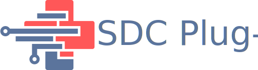

# Welcome

The SDC Plug-a-thon is regularly conducted informal workshop to bring together providers of middlewares implementing the IEEE SDC standards.
The event is a joint endeavor led by the OR.NET association and IHE Germany, helping to

- Build the implementation community of interest
- [Explore and resolve technical issues](https://github.com/IHE/DEV.SDPi/issues) related to the [SDC/SDPi+FHIR specification](https://profiles.ihe.net/DEV/SDPi/index.html)
- Develop test plans and scripts that will support subsequent IHE Connectathon testing and product Conformity Assessment
- Develop the test tooling used for CAT & CA V&V testing
- Develop the virtual testing infrastructure needed to conduct SDC/SDPi+FHIR testing in virtual and hybrid testing events

Participation is open to all interested organizations. To learn more, contact David Gregorczyk (david.gregorczyk:lucide-at-sign:ornet.org) or Max Rockstroh (max.rockstroh:lucide-at-sign:ornet.org), or visit the [SDPi+FHIR Homepage](https://confluence.hl7.org/spaces/GP/pages/66926431/Device+Interoperability+using+SDPi+FHIR).
